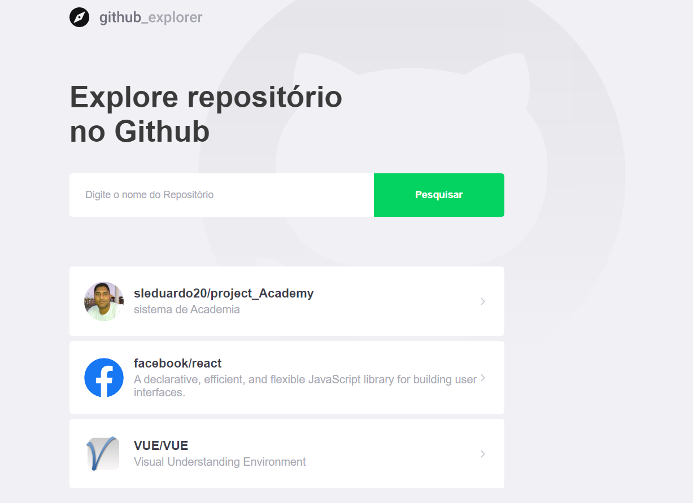

<p align="center">
  <a href="" rel="noopener">
 </a>
</p>


<div align="center">

[]()

[](https://github.com/kylelobo/The-Documentation-Compendium/pulls)

</div>

---

<p align="center"> Few lines describing your project.
    <br>
</p>

## 📝 Índice

- [Sobre](#about)
- [Instalação](#Instalacao)
- [Techs Utilizadas](#built_using)
- [Agradecimentos](#acknowledgement)
---
## 🧐 Sobre <a name = "about"></a>

Desenvolvido para pesquisar repositórios do github e listar suas issues.



---
### 💻 Instalação <a name="Instalacao"></a>

Voce pode fazer o clone do repositorio com o comando

```
Give the example
```

Depois faça a instalação dos pacotes com:

```
yarn
```
Ou se não estiver usando yanr:
```
npm install
```
---
## ⛏️ Techs Utilizadas <a name = "built_using"></a>

- [React](https://reactjs.org/) - Web Framework
---
## 🎉 Agradecimentos <a name = "acknowledgement"></a>

  Todo o time da Rocketseat.
